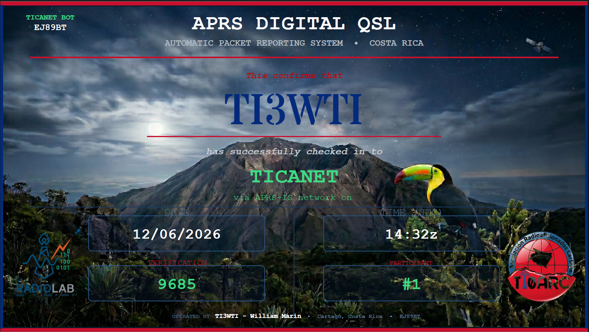

# TICANET Bot - QSL Digital vía APRS

Bot APRS-IS standalone para gestión de nets y emisión de QSL digitales automatizadas.

Desarrollado y operado por **TI3WTI** — RadioLab TEC / TI0ARC, Cartago, Costa Rica. Grid EJ89BT.

Inspirado en [MYANET APRS Bot](http://9w2key.blogspot.com/) de 9W2KEY (Malasia).

## ¿Qué hace?

Un operador de radioaficionado envía un mensaje APRS al bot (por ejemplo `CQ TICANET`). El bot responde con un código de verificación. El operador ingresa ese código en un formulario web y recibe automáticamente una QSL digital personalizada en formato PDF por correo electrónico.

```
┌──────────┐                ┌──────────────┐              ┌──────────────┐
│ OPERADOR │                │  TICANET Bot │              │    Google    │
│ (APRS)   │                │  (RPi 3B+)   │              │    Cloud     │
└────┬─────┘                └──────┬───────┘              └──────┬───────┘
     │                             │                             │
     │  1. CQ TICANET              │                             │
     │ ──────────────────────────> │                             │
     │                             │  2. POST código + datos     │
     │                             │ ──────────────────────────> │
     │  3. Bienvenido! Code: 2179  │                             │ Sheets
     │ <────────────────────────── │                             │
     │                             │                             │
     │  4. Llena formulario con código                           │
     │ ─────────────────────────────────────────────────────────>│ Form
     │                             │                             │
     │                             │  5. Valida código           │
     │                             │     Genera PDF desde Slides │
     │  6. QSL PDF por email       │     Envía por Gmail         │
     │ <─────────────────────────────────────────────────────────│ Apps Script
     │                             │                             │
```

## Ejemplo de QSL



## Eventos soportados

El bot soporta múltiples eventos simultáneos. Cada evento tiene su propio comando CQ, horario y plantilla QSL independiente. No es necesario modificar el código del bot ni del Apps Script para agregar nuevos eventos: solo se edita `events.json`.

| Comando | Aliases | Evento | Disponibilidad | Plantilla |
|---------|---------|--------|----------------|-----------|
| `CQ TICANET` | `CQ`, `CHECKIN`, `TICANET` | Net general TICANET | 24/7, todos los días | QSL general |
| `APRSDAY` | `CQ THURSDAY`, `JUEVES APRS`, `JUEVES`, `CQ JUEVES` | Jueves de APRS CR | Jueves, todo el día | QSL Thursday |
| `CQ MATUTINA` | `CQ REVISTA` | Revista Matutina TI0ARC | 2do domingo de cada mes | QSL Revista |
| `CQ ESPECIAL` | (configurable) | Actividades especiales | Fechas configurables | QSL por evento |

Los **aliases** son comandos alternativos que activan el mismo evento. Por ejemplo, `APRSDAY`, `CQ THURSDAY`, `JUEVES APRS`, `JUEVES` y `CQ JUEVES` registran todos un check-in en el evento Jueves de APRS. Se definen en el campo `aliases` de cada evento en `events.json`.

## Comandos disponibles

Todos los comandos se envían como mensaje APRS dirigido a **TICANET**. No distinguen mayúsculas/minúsculas (el bot normaliza el texto), pero deben escribirse de forma exacta (sin texto adicional, salvo los comandos que aceptan argumentos como `DIST`).

### Comandos de check-in

| Comando | Aliases | Acción |
|---------|---------|--------|
| `CQ TICANET` | `CQ`, `CHECKIN`, `TICANET` | Check-in a la net general (24/7) |
| `APRSDAY` | `CQ THURSDAY`, `JUEVES APRS`, `JUEVES`, `CQ JUEVES` | Check-in al Jueves de APRS |
| `CQ MATUTINA` | `CQ REVISTA` | Check-in a la Revista Matutina (2do domingo) |

### Comandos de consulta y servicio

| Comando | Aliases | Acción |
|---------|---------|--------|
| `LIST` | `LISTA` | Lista de indicativos con check-in en el evento activo |
| `STATUS` | `ESTADO` | Cantidad de check-ins del evento activo |
| `UPTIME` | `UP` | Tiempo que lleva activo el bot |
| `HORA` | `UTC`, `TIME` | Hora actual UTC y local |
| `CLIMA` | `WX`, `TIEMPO` | Clima actual en la ubicación del bot (Cartago) |
| `GRID` | `LOCATOR`, `QTH` | Grid locator Maidenhead y coordenadas del bot |
| `DIST` | `DISTANCIA`, `QRB` | Distancia y azimut entre estaciones (ver abajo) |
| `INFO` | `HELP`, `AYUDA`, `?` | Comandos de check-in disponibles y otros comandos |
| `EVENTOS` | `EVENTS` | Lista de todos los eventos programados |
| `SALIR` | `QUIT`, `EXIT`, `KELUAR` | Despedida (el registro se mantiene) |

### Comando DIST

Calcula distancia (km) y azimut entre estaciones, usando la última posición conocida en aprs.fi. Acepta tres formas:

| Forma | Qué calcula | Ejemplo de respuesta |
|-------|-------------|----------------------|
| `DIST` | Del operador a TICANET | `TI3WTI-10 a TICANET: 4 km, azimut 132. 73!` |
| `DIST CALL` | Del operador hasta CALL | `TI3WTI-10->TG5ALY-9: 1002 km, azimut 307. 73!` |
| `DIST CALL1 CALL2` | Entre dos estaciones | `TI3ATS->XE3JCL: 1820 km, azimut 318. 73!` |

Si el indicativo se escribe sin SSID y no se encuentra, el bot prueba automáticamente los SSID más comunes (-9, -10, -7, etc.) en una sola consulta, y responde con el indicativo real hallado. Requiere una API key de aprs.fi configurada en `config.json` (campo `aprsfi_api_key`); sin ella, el comando indica que no está disponible.

## Mensajes de respuesta del bot

| Situación | Respuesta(s) |
|-----------|--------------|
| Check-in nuevo | `BIENVENIDO a {evento}! Participante #{N}.` + `Tu codigo: {código} Reclama tu QSL: {URL}` + `Espera {N}s antes de enviar otro mensaje. 73!` |
| Check-in repetido el mismo día | `Ya registrado en {evento}! Codigo: {código} QSL: {URL}` |
| Evento no activo en ese horario | `{evento} no esta activo ahora. {descripción}. 73!` |
| `UPTIME` | `TICANET activo: 3d 14h 22m. 73!` |
| `HORA` | `UTC 04:18 \| Local 22:18 (17/06/2026)` |
| `CLIMA` | `WX Cartago: 20.0C, HR 91%, viento 0.6km/h. 73!` |
| `GRID` | `TICANET QTH: EJ89bt (9.8320, -83.8809)` |
| `DIST` | `TI3WTI-10 a TICANET: 4 km, azimut 132. 73!` |
| `LIST` sin check-ins | `Aun no hay check-ins.` |
| `STATUS` | `{evento} \| Check-ins: {N}` |
| Comando no reconocido | `Cmd no reconocido. Envia INFO para ayuda.` |

> Los comandos `CLIMA` y `GRID` usan la ubicación configurada del bot (Cartago), no la del operador que pregunta. `CLIMA` obtiene los datos de [open-meteo](https://open-meteo.com/) (sin API key).

## Arquitectura

```
┌─────────────────┐     ┌──────────────┐     ┌─────────────────────┐
│  APRSDroid /    │     │  TICANET Bot │     │  Google Cloud       │
│  Radio + iGate  │────>│  (RPi 3B+)   │────>│  Sheets + Forms +   │
│                 │<────│  Python 3    │     │  Slides + Gmail     │
└─────────────────┘     └──────────────┘     └─────────────────────┘
        APRS-IS              aprslib              Apps Script
```

- **Bot**: Python 3 + aprslib, corre en Raspberry Pi 3B+ (o cualquier sistema con Internet)
- **Datos locales**: CSV por evento/fecha en la RPi
- **Datos en la nube**: Google Sheets recibe los códigos vía HTTP POST
- **Certificados**: Google Slides (plantilla por evento) → PDF → Gmail automático
- **Formulario**: Google Forms para reclamar la QSL con código de verificación

## Requisitos

### Hardware

- Raspberry Pi 3B+ (o cualquier dispositivo con Python 3 e Internet)
- MicroSD 8GB+ con Raspberry Pi OS Lite
- Fuente de alimentación estable
- Conexión WiFi (2.4 GHz para RPi 3 Model B) o Ethernet

### Software

- Python 3.10+
- `aprslib` y `requests` (se instalan con pip)

### Cuentas

- Indicativo de radioaficionado válido con passcode APRS-IS
- Cuenta de Google (para Forms, Sheets, Slides, Apps Script)
- (Opcional) API key de [aprs.fi](https://aprs.fi/page/api) para el comando `DIST`

## Instalación rápida

```bash
# 1. Clonar repositorio
git clone https://github.com/ti3wti/TICANET.git
cd TICANET

# 2. Instalar dependencias
pip3 install aprslib requests --break-system-packages

# 3. Crear archivos de configuración
cp config.example.json config.json
cp events.example.json events.json

# 4. Editar config.json con tus credenciales
nano config.json

# 5. Editar events.json con tus eventos y template_id
nano events.json

# 6. Probar manualmente
python3 ticanet_bot.py

# 7. Instalar como servicio
sudo cp ticanet.service /etc/systemd/system/
sudo systemctl daemon-reload
sudo systemctl enable ticanet
sudo systemctl start ticanet
```

Ver logs en vivo:

```bash
journalctl -u ticanet -f
```

Para instrucciones detalladas paso a paso, ver [INSTALL.md](INSTALL.md).

## Configuración

### config.json (no se sube a Git)

```json
{
    "callsign": "TICANET",
    "login": "TU_INDICATIVO",
    "passcode": "TU_PASSCODE",
    "host": "rotate.aprs2.net",
    "port": 14580,
    "beacon_enabled": true,
    "beacon_interval": 1800,
    "latitude": 0.0000,
    "longitude": 0.0000,
    "timezone_offset": -6,
    "beacon_comment": "TICANET Bot - QSL Digital",
    "beacon_symbol_table": "/",
    "beacon_symbol": "#",
    "data_dir": "/home/tecnico/ticanet-bot/data",
    "events_file": "/home/tecnico/ticanet-bot/events.json",
    "log_file": "/home/tecnico/ticanet-bot/ticanet.log",
    "msg_cooldown": 8,
    "ack_retries": 3,
    "sheets_webhook_url": "https://script.google.com/macros/s/.../exec",
    "aprsfi_api_key": "TU_APRSFI_API_KEY"
}
```

> El campo `timezone_offset` se usa para el comando `HORA`. La latitud/longitud se usan para el beacon y los comandos `CLIMA` y `GRID`. El campo `aprsfi_api_key` habilita el comando `DIST` (obtené una key gratuita en aprs.fi).

### events.json

Cada evento define su comando, horario y plantilla:

```json
[
    {
        "id": "ticanet_general",
        "name": "TICANET",
        "command": "CQ TICANET",
        "aliases": ["CQ", "CHECKIN", "TICANET"],
        "type": "special",
        "start_date": "2026-01-01",
        "end_date": "2030-12-31",
        "start_time": "00:00",
        "end_time": "23:59",
        "timezone_offset": -6,
        "cumulative": true,
        "number_offset": 0,
        "description": "Net general TICANET - Disponible 24/7",
        "template_id": "ID_DE_GOOGLE_SLIDES",
        "form_url": "https://tinyurl.com/YOUR_FORM",
        "active": true
    }
]
```

#### Tipos de evento

| Tipo | Campos requeridos | Ejemplo |
|------|-------------------|---------|
| `weekly` | `day_of_week` (0=Lun, 6=Dom) | APRS Thursday |
| `monthly` | `week_of_month`, `day_of_week` | Revista Matutina (2do domingo) |
| `special` | `start_date`, `end_date` | Net general / Actividad especial |

#### Campos de cada evento

| Campo | Descripción |
|-------|-------------|
| `command` | Comando principal que activa el evento |
| `aliases` | Lista de comandos alternativos que también activan el evento |
| `start_time` / `end_time` | Ventana horaria diaria en **hora local** (según `timezone_offset`), no UTC |
| `timezone_offset` | Desfase respecto a UTC (Costa Rica = `-6`) |
| `description` | Texto que se muestra cuando el evento no está activo |
| `template_id` | ID de la plantilla de Google Slides para la QSL de ese evento |
| `form_url` | URL del formulario para reclamar la QSL |
| `active` | Si el evento está habilitado |

#### Campos opcionales de numeración

| Campo | Tipo | Descripción |
|-------|------|-------------|
| `cumulative` | bool | Si es `true`, el número de participante es **continuo** y no se reinicia por día (cuenta todos los CSV del evento). Si se omite o es `false`, la numeración se reinicia cada día. |
| `number_offset` | int | Número base que se suma al conteo acumulado. Útil para arrancar desde un número específico (ej. `37` hace que el siguiente participante sea el `#38`). |

> **Nota sobre horarios:** `start_time` y `end_time`, así como el día de la semana y las fechas, se evalúan en **hora local** del evento (UTC + `timezone_offset`). El único valor en UTC es el timestamp guardado en el CSV y el marcador `{{TIME_UTC}}` de la QSL. Las ventanas que cruzan la medianoche (ej. 22:00 a 02:00) no están soportadas; usar 00:00 a 23:59 para día completo.

## Numeración de participantes

Por defecto, cada evento numera a los participantes por día: el primer check-in de cada fecha es `#1`. Esto es lo deseable para eventos recurrentes como la Revista Matutina, donde cada emisión arranca su propia cuenta.

Para la net general (`ticanet_general`) la numeración es **acumulativa**: con `cumulative: true` el número crece de forma continua entre días, de modo que un operador puede ser `#38` hoy y `#150` semanas después. El campo `number_offset` permite continuar una numeración previa (por ejemplo, si ya hubo 37 check-ins antes de activar el modo acumulativo, `number_offset: 37` hace que el siguiente sea `#38`).

> En modo acumulativo, el conteo se calcula como (filas existentes en la carpeta del evento) + `number_offset`. Si se activa el offset sobre datos previos, conviene respaldar y vaciar los CSV antiguos de la carpeta del evento para que el número inicial sea exacto.

Un mismo operador puede reportarse de nuevo en días distintos y recibir un código y número nuevos; el bloqueo de doble check-in aplica solo dentro de la misma fecha.

## Google Apps Script

El archivo `apps_script/Codigo.gs` contiene el código para Google Apps Script que:

1. **doPost()**: Recibe códigos del bot vía HTTP POST y los escribe en la hoja "Codes".
2. **onFormSubmit()**: Valida el código ingresado en el formulario, genera el PDF desde la plantilla de Google Slides y lo envía por correo.

### Configuración del Apps Script

1. Crear Google Form con campos: Indicativo, Código, Email
2. Vincular respuestas a Google Sheet
3. Crear hoja "Codes" en el mismo Sheet
4. Extensiones → Apps Script → pegar código de `apps_script/Codigo.gs`
5. Configurar `TEMPLATE_ID_DEFAULT` con el ID de la plantilla de Google Slides
6. Implementar como App Web (acceso: cualquier persona)
7. Crear trigger: `onFormSubmit` → Al enviar formulario

### Plantilla QSL (Google Slides)

Crear una presentación con estos marcadores en el texto:

| Marcador | Se reemplaza por |
|----------|-----------------|
| `{{CALLSIGN}}` | Indicativo del operador |
| `{{EVENT}}` | Nombre del evento |
| `{{DATE}}` | Fecha del check-in |
| `{{TIME_UTC}}` | Hora UTC del check-in |
| `{{CODE}}` | Código de verificación |
| `{{NUMBER}}` | Número de participante |

## Estructura del proyecto

```
TICANET/
├── ticanet_bot.py          # Bot principal
├── config.json             # Configuración (NO en Git)
├── config.example.json     # Ejemplo de configuración
├── events.json             # Eventos activos (NO en Git)
├── events.example.json     # Ejemplo de eventos
├── ticanet.service         # Archivo systemd
├── apps_script/
│   └── Codigo.gs           # Google Apps Script
├── templates/              # Plantillas QSL (Google Slides)
├── data/                   # CSV de check-ins (NO en Git)
│   ├── ticanet_general/
│   ├── aprs_thursday/
│   └── revista_matutina/
├── INSTALL.md              # Guía de instalación detallada
├── LICENSE
└── README.md
```

## Créditos

- **Inspiración**: [MYANET APRS Bot](http://9w2key.blogspot.com/) por 9W2KEY (Malasia)
- **Biblioteca APRS**: [aprslib](https://github.com/rossengeorgiev/aprs-python)
- **Referencia**: [APRSD](https://github.com/craigerl/aprsd) por KM6LYW
- **Datos de posición**: el comando `DIST` usa datos de [aprs.fi](https://aprs.fi/), provistos por Heikki Hannikainen (OH7LZB). Los datos de posición mostrados por `DIST` provienen de aprs.fi.
- **Clima**: el comando `CLIMA` usa datos de [open-meteo](https://open-meteo.com/).

## Licencia

MIT License — ver [LICENSE](LICENSE).

## Contacto

- **Operador**: Ing. William Marín Moreno ([TI3WTI](https://www.qrz.com/db/TI3WTI))
- **TI0ARC** — [Asociación de Radioaficionados de Cartago](http://www.ti0arc.org/)
- **RadioLab TEC** — ITCR, Cartago, Costa Rica (https://www.tec.ac.cr/ingenieria-electronica)
